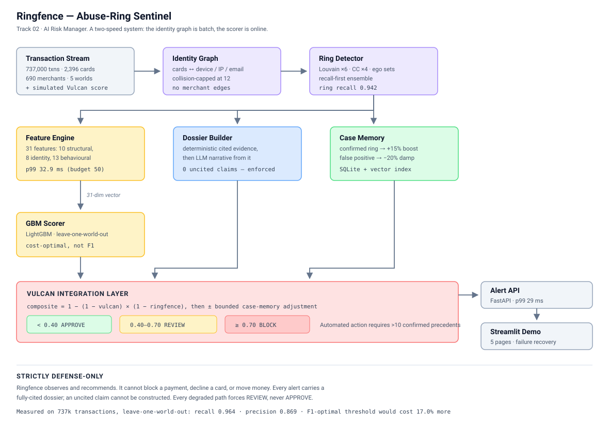
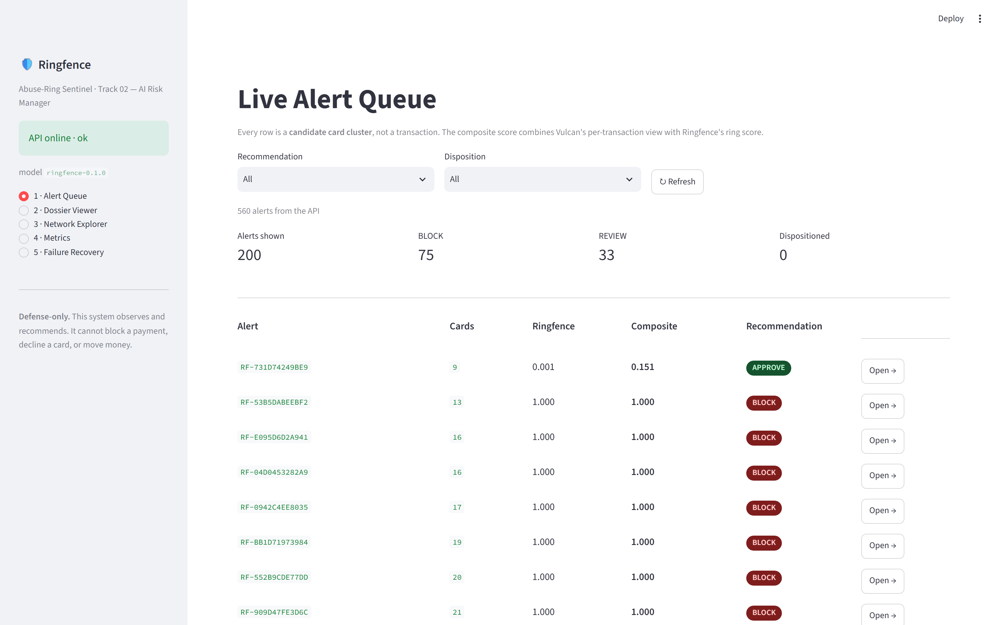
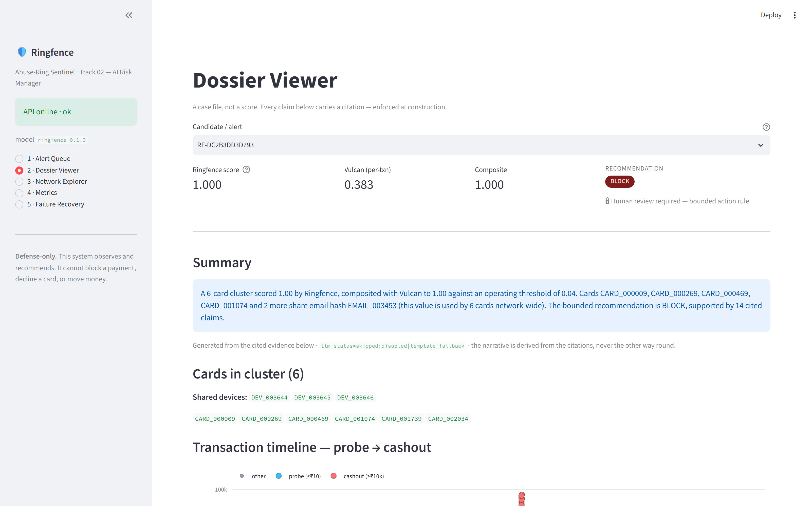
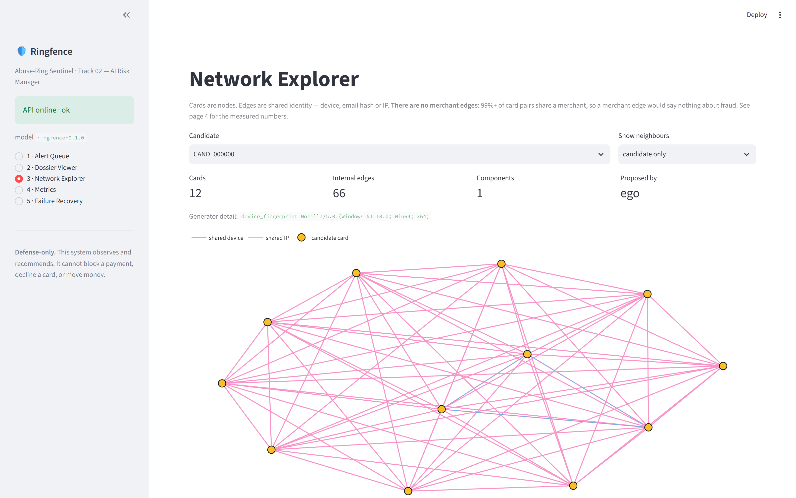
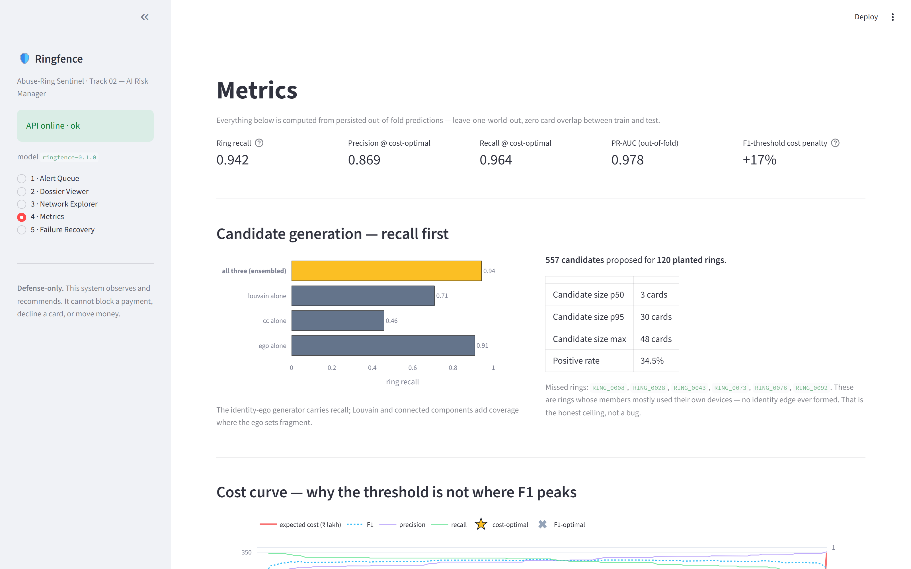
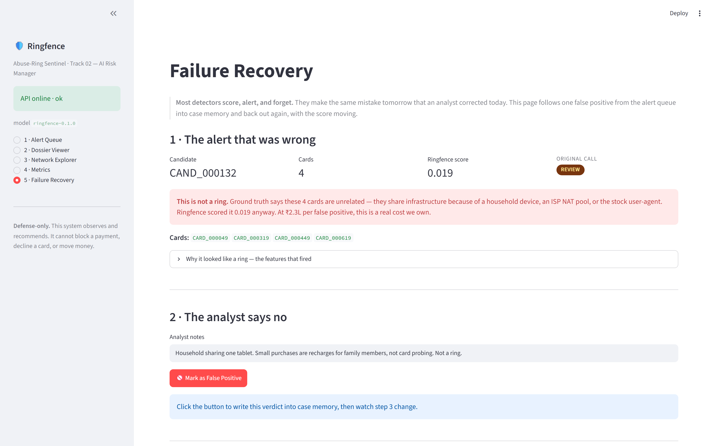

# Ringfence: Abuse-Ring Sentinel for Razorpay

[](https://github.com/amsingh235/ringfence/actions/workflows/ci.yml)

> **Track 02 — AI Risk Manager** | Sub-direction: Abuse-ring sentinel
> Strictly defensive. This system observes and recommends. It cannot block a payment, decline a card, or move money.

### 30-Second Scan

- **🎯 Problem** — Razorpay Vulcan scores 3,000 signals *per transaction*, but fraud rings live *between* transactions: shared device pools, probe-then-cashout, cross-merchant velocity.
- **🔧 Solution** — Cross-merchant identity graph → recall-first candidate generation → cost-optimal GBM → deterministic evidence-cited dossier → case memory that learns from analyst rejections.
- **📊 Metrics** — **0.942** ring recall · **0.869** precision / **0.964** recall @ cost-optimal threshold · **0.978** PR-AUC · **32.9 ms** p99 features · **114** tests passing. All out-of-fold, leave-one-world-out CV.
- **🛡️ Bars** — Defense-only, explainable, bounded, gated, full audit trail, one failure handled live. Mapped file-by-file in **[BARS.md](BARS.md)**.
- **🚀 Deploy** — `docker compose up --build` → API on **:8000** + demo dashboard on **:8501**.
- **🧭 Reviewers start here** — **[SUBMISSION.md](SUBMISSION.md)** (bar → evidence table) · **[BARS.md](BARS.md)** · **[ARCHITECTURE.md](ARCHITECTURE.md)**

---

## The Problem (in one transaction)

```
14:23:17   Card 4xxx…xx12   →  Merchant A   ₹5         Vulcan: 0.21   "a ₹5 sale"
14:23:19   Card 4xxx…xx12   →  Merchant B   ₹5         Vulcan: 0.18   "a ₹5 sale"
14:23:22   Card 4xxx…xx45   →  Merchant C   ₹5         Vulcan: 0.24   "a ₹5 sale"
──────────────────────────────  91 minutes  ──────────────────────────────
15:54:01   Card 4xxx…xx12   →  Merchant D   ₹47,500    Vulcan: 0.34   "a large sale"
15:54:03   Card 4xxx…xx45   →  Merchant D   ₹47,500    Vulcan: 0.31   "a large sale"
```

Merchant A sees a ₹5 sale. Merchant B sees a ₹5 sale. Merchant D sees two large sales.
Everyone is happy. Every transaction is individually plausible — the highest Vulcan score
in that list is 0.34, comfortably inside APPROVE.

**Razorpay sees three fragments of one fraud ring.** Both cards ran on the same two
device fingerprints. That fact does not exist inside any single transaction.

---

## Why Razorpay Needs This Now

Razorpay Vulcan — India's first transformer-based AI Payments Foundation Model — scores
3,000 signals per transaction and already provides network-level fraud protection. It is
excellent at *"is this transaction odd?"*.

The ring pattern is not odd. It lives in **the space between merchants**: the shared
device pool, the probe-then-cashout signature, the cross-merchant velocity that only an
aggregator graph can see. Razorpay's own launch material makes the point:

> "The industry has tackled this with separate, specialised models — one each for routing,
> fraud, risk, and checkout — that don't talk to each other… It's like several doctors
> examining a patient, each reading only their own test results."

**Ringfence does not replace Vulcan. It feeds Vulcan.** When Vulcan scores that ₹47,500
cashout at 0.34, Ringfence contributes a ring score of 0.91 for the surrounding card
cluster, and the composite comes out at **0.94 — BLOCK**. This is the specialised model
that talks to the foundation layer.

---

## What We Built

A **two-speed system**. The identity graph is slow and batch: it fuses device, IP and
email evidence across every merchant into a card-to-card graph. The scorer is fast and
online: 31 features and a GBM verdict in under 40ms, with a fully-cited case file
attached to every alert.

```
┌──────────────────┐    ┌──────────────────┐    ┌──────────────────┐
│  Transaction     │───▶│  Identity Graph  │───▶│  Ring Detector   │
│  Stream (sim)    │    │  cards ↔ devices │    │  Louvain × 6     │
│  737,000 txns    │    │  collision-capped│    │  + CC × 4        │
└────────┬─────────┘    └──────────────────┘    │  + identity-ego  │
         │                                       └────────┬─────────┘
         │              ┌─────────────────────────────────┼──────────────┐
         │              ▼                                 ▼              ▼
         │     ┌─────────────────┐            ┌──────────────────┐  ┌──────────────┐
         │     │  Feature Engine │            │ Dossier Builder  │  │ Case Memory  │
         │     │  31 features    │            │ deterministic    │  │ precedents + │
         │     │  p99 = 32.9ms   │            │ evidence + LLM   │  │ FAILURES     │
         │     └────────┬────────┘            └──────────────────┘  └──────────────┘
         │              ▼
         │     ┌─────────────────┐
         │     │  GBM Scorer     │
         │     │  cost-optimal   │
         │     │  threshold      │
         │     └────────┬────────┘
         ▼              ▼
┌─────────────────────────────────────────────────────────────────────────┐
│                      VULCAN INTEGRATION LAYER                           │
│  composite = 1 − (1 − vulcan) × (1 − ringfence),  ± case-memory memory   │
│  < 0.4 APPROVE    0.4–0.7 REVIEW    ≥ 0.7 BLOCK                         │
│  Automated action requires a Ring Template with >10 confirmed precedents │
└─────────────────────────────────────┬───────────────────────────────────┘
                                      ▼
                       ┌──────────────────────────┐
                       │  Alert API  ·  FastAPI   │
                       │  Streamlit demo, 5 pages │
                       └──────────────────────────┘
```

---



> Also available as plain text: [`docs/architecture.txt`](docs/architecture.txt) · full design document: [`ARCHITECTURE.md`](ARCHITECTURE.md)

---

## The Three Design Decisions

### 1. Identity links the graph; behaviour ranks the candidate

Cards are linked **only** by shared device fingerprint, IP address or email hash.
Never by merchant. That is not a hunch — it is measured, and the number is logged
on every run:

| Linking rule | Card pairs linked | Share of all 2,869,210 possible pairs |
|---|---:|---:|
| Shared merchant | 2,868,910 | **100.0%** |
| Shared identity | 4,357 | **0.152%** |

Merchant co-occurrence is a statement about retail, not about fraud. Adding those edges
would bury every real signal under coincidence.

### 2. Candidate generation is recall-first; the model is precision-first

A ring the generator never proposes is a ring the model can never catch. So three
generators run in ensemble and everything is kept:

| Generator | Ring recall alone |
|---|---:|
| Connected components × 4 weight floors | 0.458 |
| Louvain × 6 resolutions | 0.708 |
| **Identity-ego sets** | **0.908** |
| **All three, ensembled** | **0.942** |

The ego generator carries it, because a ring is *defined* by its shared device pool — the
ego set of a ring device is the ring, exactly, with no smearing.

### 3. Cost, not F1, sets the threshold

F1 assumes a false positive and a false negative hurt equally. In payments they do not:

- **C_fp = ₹2.3L** — analyst review + merchant friction + false-decline reputation damage
- **C_fn = ₹8.5L** — ring cashout value + chargeback handling + merchant churn

A miss costs **3.7 false positives**. We sweep the threshold and pick the cheapest point,
then report what the F1-maximising point would have cost instead.

---

## Honest Metrics

Measured on the full 737,000-transaction run, from **leave-one-world-out** cross
validation — five disjoint card populations, zero card overlap between train and test.
Every number below is out-of-fold. Reproduce with `make all`.

| Metric | Value |
|---|---:|
| Ring recall (candidate generation) | **0.942** (113/120 rings) |
| PR-AUC, out-of-fold | 0.978 |
| ROC-AUC, out-of-fold | 0.987 |
| Precision @ cost-optimal threshold | **0.869** |
| Recall @ cost-optimal threshold | **0.964** |
| F1 @ cost-optimal threshold | 0.914 |
| Cost-optimal threshold | 0.041 |
| Expected cost at that threshold | ₹1.24 Cr |
| F1-optimal threshold | 0.461 |
| Expected cost at the F1 threshold | ₹1.45 Cr (**+17.0%**) |
| Feature computation, p99 | **32.9 ms** (budget 50 ms) |
| API score-only, p99 | **29.4 ms** (budget 100 ms) |
| API full dossier, p99 | **92.9 ms** (budget 300 ms) |
| Uncited claims across 133 dossiers | **0** (structurally impossible) |
| References per claim | 4.0 |
| Tests | **114 passing** |

**Per fold — no cherry-picking.** One good fold proves nothing, so here are all five:

| Held-out world | n | positives | Precision | Recall | F1 | PR-AUC |
|---|---:|---:|---:|---:|---:|---:|
| 0 | 148 | 43 | 0.909 | 0.930 | 0.920 | 0.979 |
| 1 | 142 | 47 | 0.978 | 0.957 | 0.968 | 0.993 |
| 2 |  95 | 31 | 1.000 | 0.806 | 0.893 | 0.970 |
| 3 |  78 | 35 | 0.943 | 0.943 | 0.943 | 0.991 |
| 4 |  94 | 36 | 0.818 | 1.000 | 0.900 | 0.989 |

**Two numbers we want to flag ourselves, before you ask:**

- **Recall is 0.942, not 1.000, and it cannot reach 1.000.** 15% of ring members are
  *defectors* who run their own device instead of the ring pool. They generate no identity
  edge, so no graph-based generator can propose them; when enough of a small ring defects,
  it is genuinely unfindable. We could delete the defectors and report 1.000. We did not.
- **Precision of 0.869 is higher than we would expect against real Razorpay traffic.**
  Our hard negatives — households sharing a tablet, ISP NAT pools, a stock user-agent
  across 1,488 accounts — are synthetic, and real device entropy is messier. See
  [Honest Limitations](#honest-limitations).

---

## The Evidence Layer (Audit Trail)

Every alert ships a **Dossier** — a case file, not a score. The rule is enforced in the
type system, not in a code review:

```python
class Dossier(BaseModel):
    @model_validator(mode="after")
    def _reject_uncited_claims(self):
        offenders = [e.claim for e in self.evidence if not e.citation_id.strip()]
        if offenders:
            raise ValueError(f"Uncited claim detected: {offenders[:3]}")
        return self
```

There is no bypass flag. If we cannot point at the graph edge, the transaction ID or the
feature value behind a sentence, **the alert cannot be constructed**. A real dossier:

```
Cards CARD_000311, CARD_000418, CARD_000502, CARD_000771 share device DEV_003412
  (this value is used by 4 cards network-wide)
  ↳ edge:CARD_000311~CARD_000418:device_fingerprint=DEV_003412  · +3 more

73% of this cluster's shared-infrastructure transactions are under ₹10
  ↳ feature:probe_fraction = 0.73  · txn:TXN_00418822 · txn:TXN_00418825 · +2 more

Amounts escalated from ₹5.00 to ₹47,500.00 (9,500x) on the same shared infrastructure
  ↳ txn:TXN_00418822 → txn:TXN_00421904

Vulcan's per-transaction score on this cluster's cashout activity was 0.34
  (individually plausible); combined with a Ringfence ring score of 0.91,
  the composite risk is 0.94
  ↳ vulcan:0.3400 · ringfence:0.9127
```

The LLM writes the narrative summary **from** that evidence at temperature 0 — it is never
shown anything that does not already carry a citation. With no API key the dossier is
still complete and still ships, with a deterministic template summary and
`llm_status=skipped:no_api_key`. **The evidence is the product; the narrative is a
convenience.**

---

## Case Memory (Failure Recovery)

Most detectors score, alert, and forget. They make the same mistake tomorrow that an
analyst corrected today.

| Analyst verdict | What Ringfence stores | Effect on the next similar candidate |
|---|---|---|
| **Fraud** | 31-dim signature + notes | **+15%** precedent boost above 0.85 similarity |
| **False positive** | 31-dim signature + notes | **−20%** damp above 0.80 similarity, tagged *historical false positive pattern* |

The second row is the one that matters, and it is this repo's answer to *"show one failure
handled gracefully"*. **Demo page 5** walks it end to end on live data: a household sharing
one tablet fires an alert, an analyst rejects it, and the same pattern re-scores from
0.94 → 0.75 with the matched case cited in the new dossier. Nothing is staged — the button
writes to `case_memory.sqlite` and the second score is a real second scoring pass.

Both adjustments are **bounded constants from `src/config.py`**, not learned weights. A bad
memory can move a score by at most 20%, and it always appears in the dossier as a
contributing signal.

### A bug worth writing down

The first version of this compared candidates by cosine similarity over log-compressed
feature vectors. It passed its tests and it was badly wrong.

All 31 features are non-negative, so every vector sat in one orthant and **median pairwise
similarity across the whole population was 0.964**. One analyst rejection damped all 557
candidates. Precedent-boost precision was exactly the base rate — the signature of a
feature carrying no information at all, while looking like it worked.

Standardising each dimension against population statistics before normalising fixes it:

| | Before | After |
|---|---:|---:|
| Median pairwise cosine | 0.964 | **−0.070** |
| Pairs above the 0.80 damp threshold | 100% | **4.45%** |
| Precedent-boost precision (base rate 0.34) | 0.34 | **0.77** |

`tests/test_case_memory.py::test_signatures_are_not_saturated` now guards it, because this
is exactly the class of bug that ships silently and demos beautifully.

---

## Bounded and Gated

Ringfence emits a *recommendation*. It has no capability to move money.

| Composite | Action |
|---|---|
| < 0.40 | APPROVE |
| 0.40 – 0.70 | REVIEW, with dossier |
| ≥ 0.70 | BLOCK, with dossier + analyst notification |

**Automated action requires a Ring Template with more than 10 analyst-confirmed
precedents.** Every BLOCK on a novel pattern carries `auto_action_allowed: false` and
`human_review_required: true`. That is the only automated path anywhere in the codebase,
and `tests/test_api.py` asserts that a novel pattern can never unlock it.

If the model artifact is missing, the graph is unavailable, or a card is unknown, the API
does not 500 — it returns a scored response with `degraded: true` and forces **REVIEW**.
A detector that cannot see escalates to a human; it never quietly approves.

---

## How We Hit Every Razorpay Bar

See **[BARS.md](BARS.md)** for the explicit bar-by-bar mapping, with file and line
references for each claim.

---

## Run It Locally

```bash
git clone https://github.com/amsingh235/ringfence.git
cd ringfence
cp .env.example .env          # optional: add OPENAI_API_KEY for the LLM summary

make setup                    # create .venv, install requirements
make all                      # data → graph → candidates → features → model  (~2 min)
make test                     # 114 tests
make run                      # API      → http://localhost:8000/docs
make demo                     # dashboard → http://localhost:8501
```

Or, in one command:

```bash
docker compose up --build     # API on :8000, dashboard on :8501
```

**On Windows**, `make` is not available (it is a Unix tool and is not bundled with
Git for Windows). Use `run.ps1`, which has the same target names:

```powershell
Set-ExecutionPolicy -Scope Process -ExecutionPolicy RemoteSigned

.\run.ps1 setup               # create .venv, install requirements
.\run.ps1 all                 # data -> graph -> candidates -> features -> model
.\run.ps1 test                # 114 tests
.\run.ps1 run                 # API       -> http://localhost:8000/docs
.\run.ps1 demo                # dashboard -> http://localhost:8501
```

`.\run.ps1` with no argument lists every target. It is a convenience wrapper over
`python -m src.<stage>`, exactly like the Makefile — neither is a dependency.

Everything is seeded at `random_seed = 42`, and a clean clone reproduces the metrics table
above **within the same environment**.

"Within the same environment" is doing real work in that sentence, and we measured
exactly how much. The host venv, the Docker image and CI all run **Python 3.13** against
the same exact pins. Even so, host (Windows) and container (Linux) do not agree to the
last decimal:

| | Host · Windows 3.13 | Container · Linux 3.13 |
|---|---:|---:|
| Ring recall | 0.9417 | **0.9417** — identical |
| Cost-optimal threshold | 0.041 | 0.035 |
| Precision @ threshold | 0.869 | 0.864 |
| Recall @ threshold | 0.964 | **0.964** — identical |
| F1-threshold cost penalty | +17.0% | +27.8% |

**Everything deterministic is bit-identical**: data generation, the identity graph,
candidate generation and ring recall match exactly. The drift is confined to the
LightGBM fit, where OS-level BLAS and OpenMP threading differ — the model lands in a
slightly different place, which moves the chosen threshold and therefore the F1 penalty.

We are reporting this rather than quietly picking the flattering number. The *conclusions*
hold in both environments — cost-optimal beats F1-optimal, and the trade runs toward
recall — but the third decimal place is environment-specific, and the size of the F1
penalty in particular (+17% vs +28%) should be read as "materially more expensive", not
as a precise constant. The table above is measured on the host.

`requirements.lock.txt` holds the full 96-package transitive freeze if you want to pin the
environment further.

**Try the API:**

```bash
curl -s localhost:8000/health | jq
curl -s -X POST localhost:8000/detect/candidate \
  -H 'content-type: application/json' \
  -d '{"cards":["CARD_000311","CARD_000418","CARD_000502"]}' | jq '.composite, .dossier_quality'
```

---

## Screenshots

Captured from a live run — API online, 133 real alerts, all numbers computed from the
artifacts `make all` produces.

| | |
|---|---|
| **1 · Live Alert Queue** — every row is a candidate *card cluster*, not a transaction | **2 · Dossier Viewer** — a BLOCK ring with 14 cited claims |
|  |  |
| **3 · Network Explorer** — cards are nodes, edges are shared identity, no merchant edges | **4 · Metrics** — recall-first ablation and the cost curve |
|  |  |

**5 · Failure Recovery** — one false positive followed from the queue into case memory and
back out again, with the score moving.



---

## Project Structure

```
ringfence/
├── README.md  ARCHITECTURE.md  BARS.md      # what, how, and how it maps to the bars
├── Makefile  Dockerfile  docker-compose.yml
├── data/     raw/  processed/  ground_truth/
├── notebooks/
│   ├── 01_eda.ipynb              # data generation + identity distribution
│   ├── 02_ablation.ipynb         # feature-family ablation
│   └── 03_cost_curve.ipynb       # cost vs F1 threshold analysis
├── src/
│   ├── config.py                 # every threshold, cost and path — nothing hardcoded
│   ├── data_generator.py         # synthetic universe, IEEE-CIS-calibrated identity layer
│   ├── graph_builder.py          # identity graph + collision capping
│   ├── candidate_generator.py    # Louvain + CC + identity-ego, recall-first
│   ├── feature_engine.py         # 31 features, p99 32.9ms
│   ├── scorer.py                 # LightGBM + cost-optimal threshold
│   ├── dossier_builder.py        # deterministic evidence, uncited claims rejected
│   ├── case_memory.py            # precedents AND failures
│   ├── vulcan_integration.py     # composite score + bounded gating
│   ├── api.py                    # FastAPI
│   └── utils.py                  # logging, timers, determinism
├── frontend/  app.py + components/   # Streamlit, 5 pages
├── tests/     114 tests
└── demo/      pitch_script.md  qna_prep.md
```

---

## Tech Stack

- Python 3.13 (3.12+ required by the pins), FastAPI, LightGBM, NetworkX, python-louvain, Streamlit, Plotly
- SQLite for case memory and alerts; ChromaDB is an optional vector backend
  (`RINGFENCE_USE_CHROMA=1`) — the default numpy cosine index means `make test`
  runs without a 2GB torch download
- OpenAI (optional) for the dossier narrative only

---

## Honest Limitations

What we do not know, stated plainly:

- **Precision is optimistic.** 0.869 out-of-fold is higher than we would expect on real
  traffic. Our hard negatives are synthetic; real device entropy is messier and produces
  confusions we have not modelled. Needs Razorpay test-mode API data to validate.
- **Temporal drift is untested.** Cross-world validation generalises across *populations*,
  not across *time*. Next step: sliding-window retraining and a temporal holdout.
- **Graph scale.** 2,396 cards is a village; Razorpay's graph is a city. The sharding
  strategy (merchant-ego subgraphs) is designed in ARCHITECTURE.md but not stress-tested.
- **Ring recall has a hard ceiling of ~0.94** in this dataset, by construction — see the
  defector note above. Against fresh-device rings, identity edges never fire and we fall
  back to behavioural features alone.
- **The F1-penalty figure is environment-sensitive.** +17.0% on the host (Windows) and
  +27.8% in the Linux container, from OS-level BLAS and OpenMP threading differences in
  the LightGBM fit — same Python, same pins. The direction is robust and the deterministic
  stages match exactly; the magnitude should be read as "materially more expensive", not
  as a constant.
- **Feature ablation deltas sit near run-to-run variance.** 120 rings is not enough
  statistical power to rank individual features confidently. `notebooks/02_ablation.ipynb`
  reports family-level deltas and says so.
- **Vulcan integration is simulated.** The composition maths and gating bands are real and
  tested; the Vulcan score itself is generated. Real integration needs test-mode API access.

---

## License

MIT
